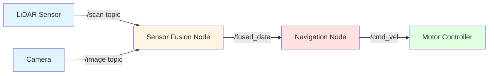
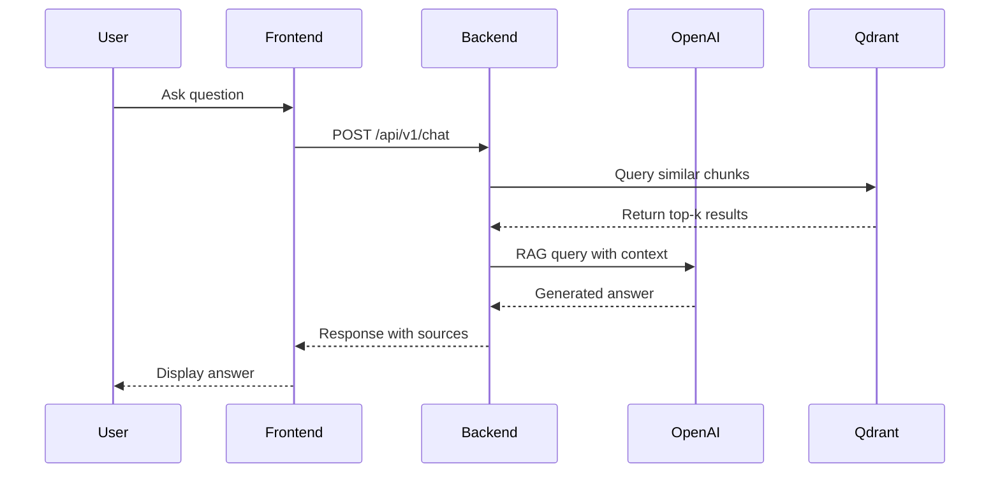
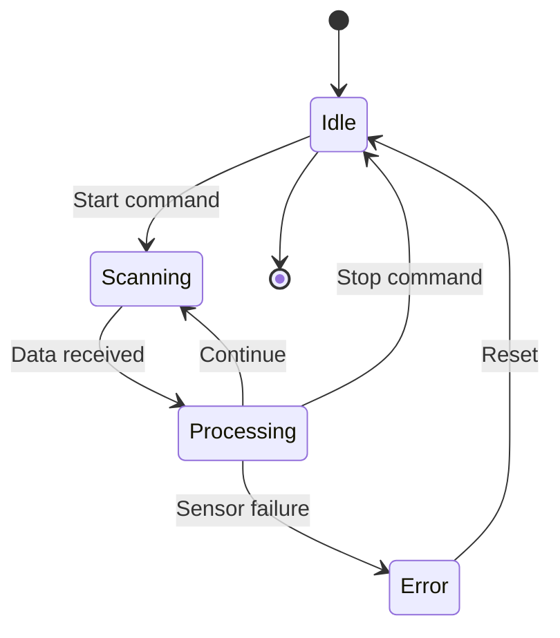
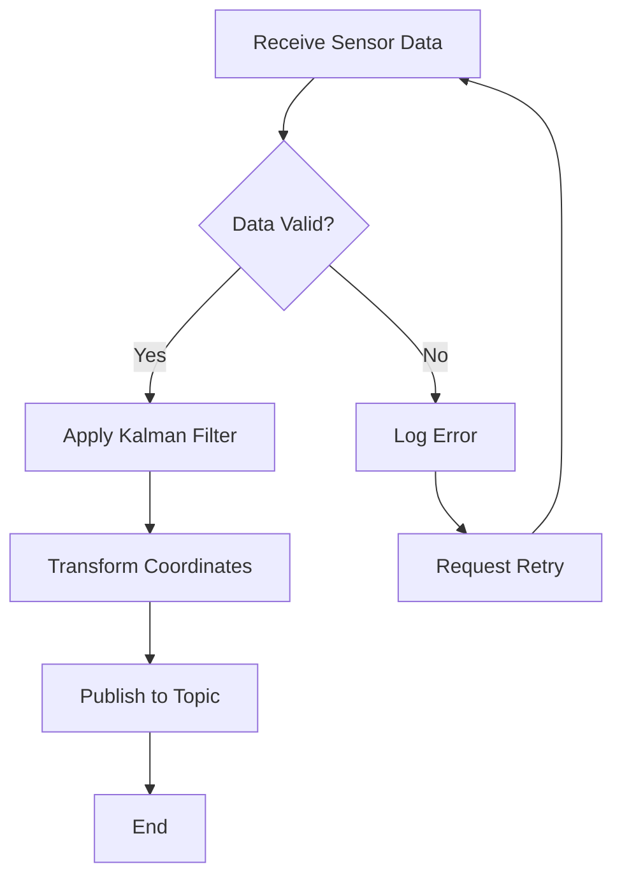
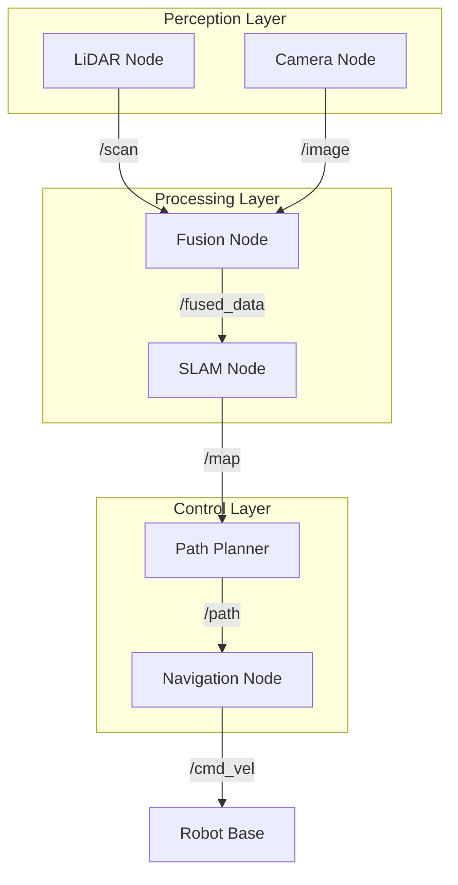
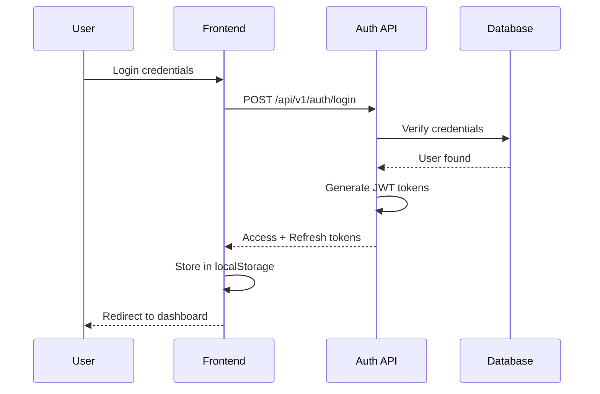
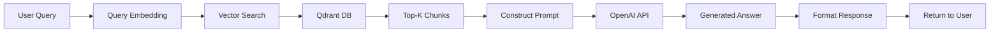

# Diagram Describer Subagent

## Purpose

The Diagram Describer subagent specializes in creating visual representations of robotics concepts, system architectures, and data flows. It generates Mermaid diagrams, ASCII art, and detailed visual descriptions that enhance understanding of complex technical concepts in the Physical AI textbook.

## Use Cases

1. **Architecture Diagrams**: Visualize ROS 2 node graphs, system architectures, and component relationships
2. **Data Flow Diagrams**: Show message passing, sensor data pipelines, and processing workflows
3. **Concept Visualizations**: Create state machines, control loops, and algorithm flowcharts
4. **System Integration**: Diagram hardware-software interfaces, network topologies, and deployment architectures

## Tools Available

The Diagram Describer subagent has access to:

- **Read**: Analyze existing chapter content and code to understand context
- **Write**: Create diagram files in markdown with Mermaid syntax
- **Edit**: Update existing diagrams based on feedback
- **WebFetch**: Reference official documentation for accurate system representations
- **Glob/Grep**: Find related diagrams and maintain consistency

## Workflow

### 1. Input Requirements

```yaml
diagram_type: "architecture" | "flow" | "sequence" | "state" | "class"
context: "Chapter 2-1: Sensor Integration"
concepts:
  - ROS 2 nodes for LiDAR and camera
  - Sensor fusion pipeline
  - Data transformation stages
output_format: "mermaid" | "ascii" | "description"
complexity_level: "simple" | "detailed" | "comprehensive"
```

### 2. Diagram Creation Process

```
Step 1: Context Analysis
- Read chapter content to understand concepts
- Identify key components and relationships
- Determine appropriate diagram type

Step 2: Design Phase
- Sketch conceptual layout
- Define nodes, edges, and labels
- Choose visual style (color, shapes, grouping)

Step 3: Implementation
- Write Mermaid syntax or ASCII art
- Add descriptive labels and annotations
- Include legend if needed

Step 4: Validation
- Verify diagram renders correctly
- Check technical accuracy
- Ensure clarity and readability
```

### 3. Supported Diagram Types

#### Architecture Diagrams (Graph)



#### Sequence Diagrams



#### State Machine Diagrams



#### Flowchart Diagrams



## Example Usage

### Via Slash Command

```bash
# Generate architecture diagram
/create-diagram --type architecture --chapter 2-1 --concept "ROS 2 Sensor Pipeline"

# Create flowchart for algorithm
/diagram-flow --algorithm "SLAM localization" --detail comprehensive

# Visualize system integration
/system-diagram --components "sensors,processing,actuation" --format mermaid
```

### Via Direct Prompt

```
Please create a Mermaid diagram showing the ROS 2 node architecture for Chapter 2-1 "Sensor Integration".

Components:
- LiDAR sensor node publishing to /scan topic
- Camera node publishing to /image_raw topic
- Sensor fusion node subscribing to both, publishing to /fused_data
- Navigation node consuming fused data, publishing to /cmd_vel
- Motor controller subscribing to /cmd_vel

Style: Use color coding for sensors (blue), processing (yellow), control (red), actuation (green)
```

## Best Practices

1. **Clarity Over Complexity**: Keep diagrams simple and focused on key concepts
2. **Consistent Styling**: Use standard colors, shapes, and conventions across all diagrams
3. **Descriptive Labels**: Use clear, concise labels that match chapter terminology
4. **Legend When Needed**: Add legends for color coding or symbol meanings
5. **Scalable Design**: Create diagrams that work at different zoom levels

## Diagram Style Guide

### Color Conventions

- **Sensors/Input**: Light blue (`#e1f5ff`)
- **Processing/Logic**: Light yellow (`#fff4e1`)
- **Control/Decision**: Light red (`#ffe1e1`)
- **Actuation/Output**: Light green (`#e1ffe1`)
- **Database/Storage**: Light purple (`#f3e1ff`)
- **External Systems**: Light gray (`#f0f0f0`)

### Shape Conventions

- **Nodes/Services**: Rectangles
- **Decisions**: Diamonds
- **Topics/Messages**: Rounded rectangles
- **Sensors/Hardware**: Rounded rectangles with icons
- **Processes**: Rectangles with double border

### Naming Conventions

- Use ROS 2 topic naming: `/namespace/topic_name`
- Use snake_case for node names: `sensor_fusion_node`
- Use clear action verbs: "Subscribe", "Publish", "Process", "Transform"

## Integration with Project

The Diagram Describer subagent enhances:

- **Chapter Content**: Visual explanations of ROS 2 concepts
- **System Architecture**: High-level system design documentation
- **Tutorial Walkthroughs**: Step-by-step visual guides
- **README Documentation**: Project structure and data flow diagrams

## Common Diagram Patterns

### ROS 2 Node Communication



### Authentication Flow



### RAG Pipeline



## Limitations

- Mermaid syntax has rendering limitations in some environments
- Complex diagrams may require multiple views for clarity
- Real-time collaboration on diagrams not supported
- Animations and interactive elements not available in static diagrams

## Related Subagents

- **Content Generator**: Consumes diagrams for chapter illustrations
- **RAG Setup**: Can diagram the document ingestion pipeline
- **Auth Setup**: Visualizes authentication flows
