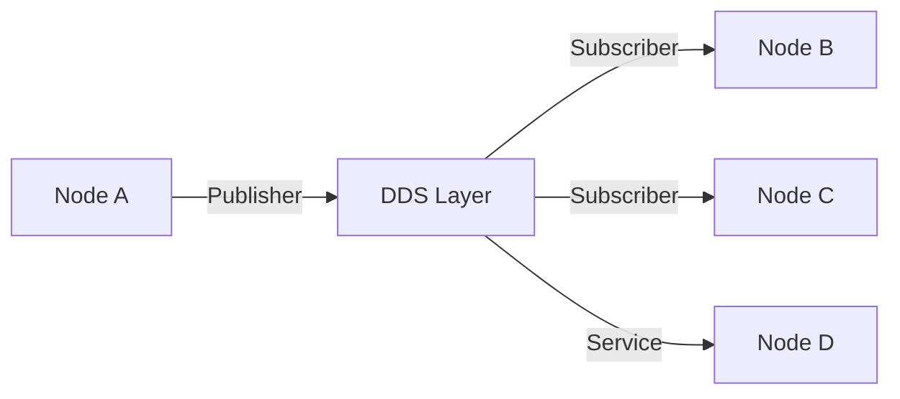

# ROS 2 Architecture & Core Concepts

## Introduction

Robot Operating System 2 (ROS 2) represents a fundamental shift in robotic middleware design, addressing the limitations of ROS 1 while introducing real-time capabilities, enhanced security, and multi-robot support. This chapter explores the architectural foundations that make ROS 2 the de facto standard for modern robotics development.

## What is ROS 2?

ROS 2 is an open-source middleware framework that provides essential services for building robot applications:

- **Communication Infrastructure**: Publish-subscribe and service-oriented messaging
- **Hardware Abstraction**: Unified interfaces for sensors and actuators
- **Package Management**: Modular software organization and dependency handling
- **Development Tools**: Debugging, visualization, and simulation utilities

Unlike traditional monolithic robot frameworks, ROS 2 adopts a **distributed computing model** where independent processes (nodes) communicate through a data distribution service (DDS).

## Core Architecture Components

### 1. Data Distribution Service (DDS)

ROS 2 leverages DDS as its underlying communication middleware, replacing ROS 1's custom TCPROS/UDPROS protocol. DDS provides:



**Key Benefits**:
- **Quality of Service (QoS)**: Configurable reliability, durability, and latency profiles
- **Discovery**: Automatic node detection without central master
- **Security**: DDS-Security for authentication and encryption
- **Interoperability**: Standards-based communication with non-ROS systems

### 2. Nodes and Executors

A **node** is the fundamental computational unit in ROS 2. Each node:
- Runs as an independent process or thread
- Communicates via topics, services, or actions
- Can be written in Python, C++, or other supported languages

```python
import rclpy
from rclpy.node import Node
from std_msgs.msg import String

class MinimalPublisher(Node):
    def __init__(self):
        super().__init__('minimal_publisher')
        self.publisher_ = self.create_publisher(String, 'topic', 10)
        self.timer = self.create_timer(0.5, self.timer_callback)
        self.i = 0

    def timer_callback(self):
        msg = String()
        msg.data = f'Hello World: {self.i}'
        self.publisher_.publish(msg)
        self.get_logger().info(f'Publishing: "{msg.data}"')
        self.i += 1

def main(args=None):
    rclpy.init(args=args)
    node = MinimalPublisher()
    rclpy.spin(node)
    node.destroy_node()
    rclpy.shutdown()
```

**Executors** manage node callbacks and handle concurrency:
- **SingleThreadedExecutor**: Sequential callback execution
- **MultiThreadedExecutor**: Parallel callback processing
- **StaticSingleThreadedExecutor**: Optimized for real-time systems

### 3. Communication Patterns

#### Topics (Publish-Subscribe)

Topics enable **one-to-many** asynchronous communication for streaming data:

```bash
# Terminal 1: Publisher
ros2 run demo_nodes_cpp talker

# Terminal 2: Subscriber
ros2 run demo_nodes_py listener
```

**Use Cases**: Sensor data streams, continuous state updates

#### Services (Request-Response)

Services provide **synchronous RPC** for one-off operations:

```python
from example_interfaces.srv import AddTwoInts

class AddService(Node):
    def __init__(self):
        super().__init__('add_service')
        self.srv = self.create_service(AddTwoInts, 'add_two_ints', self.add_callback)

    def add_callback(self, request, response):
        response.sum = request.a + request.b
        self.get_logger().info(f'{request.a} + {request.b} = {response.sum}')
        return response
```

**Use Cases**: Configuration changes, triggering specific actions

#### Actions (Goal-Oriented)

Actions combine topics and services for **long-running operations** with feedback:

```yaml
# Action definition (Fibonacci.action)
int32 order
---
int32[] sequence
---
int32[] partial_sequence
```

**Use Cases**: Navigation, manipulation tasks, path planning

## Quality of Service (QoS) Policies

QoS policies allow fine-tuned control over message delivery:

| Policy | Options | Use Case |
|--------|---------|----------|
| **Reliability** | Best Effort, Reliable | Sensor data vs. Commands |
| **Durability** | Volatile, Transient Local | State persistence |
| **History** | Keep Last(N), Keep All | Message buffering |
| **Lifespan** | Duration | Message expiration |

```python
from rclpy.qos import QoSProfile, ReliabilityPolicy, DurabilityPolicy

qos_profile = QoSProfile(
    reliability=ReliabilityPolicy.RELIABLE,
    durability=DurabilityPolicy.TRANSIENT_LOCAL,
    depth=10
)

self.publisher_ = self.create_publisher(String, 'topic', qos_profile)
```

## ROS 2 vs ROS 1: Key Differences

| Feature | ROS 1 | ROS 2 |
|---------|-------|-------|
| **Communication** | Custom TCPROS | DDS (OMG standard) |
| **Real-Time** | Limited | RTOS support via DDS |
| **Multi-Robot** | Complex | Native support |
| **Security** | None | DDS-Security |
| **Platforms** | Linux-centric | Cross-platform |
| **Master Node** | Required | Decentralized |

## Real-World Example: Perception Pipeline

```python
class LidarProcessor(Node):
    def __init__(self):
        super().__init__('lidar_processor')

        # Subscriber with sensor QoS
        self.subscription = self.create_subscription(
            LaserScan,
            '/scan',
            self.lidar_callback,
            qos_profile_sensor_data)

        # Publisher with reliable QoS
        self.publisher = self.create_publisher(
            PointCloud2,
            '/processed_cloud',
            10)

    def lidar_callback(self, msg):
        # Process LiDAR data
        cloud = self.convert_to_pointcloud(msg)
        filtered = self.remove_outliers(cloud)

        # Publish processed result
        self.publisher.publish(filtered)
        self.get_logger().info('Published filtered point cloud')
```

## Best Practices

1. **Node Decomposition**: Keep nodes focused on single responsibilities
2. **QoS Configuration**: Match QoS policies to data characteristics
3. **Parameter Management**: Use ROS parameters for runtime configuration
4. **Lifecycle Management**: Implement lifecycle nodes for state management
5. **Performance Monitoring**: Use `ros2 topic hz` and `ros2 topic bw` for profiling

## Summary

ROS 2's architecture provides a robust foundation for building scalable, real-time robotic systems. By leveraging DDS, implementing flexible QoS policies, and supporting multiple communication patterns, ROS 2 addresses the challenges of modern robotics from warehouse automation to autonomous vehicles.

## References

1. [ROS 2 Documentation - Humble](https://docs.ros.org/en/humble/)
2. [DDS Foundation - OMG Specification](https://www.omg.org/spec/DDS/)
3. [ROS 2 Design Documentation](https://design.ros2.org/)
4. [Real-Time Systems with ROS 2 (Casini et al., 2023)](https://ieeexplore.ieee.org/document/9981327)
5. [ROS 2 Quality of Service Policies](https://docs.ros.org/en/humble/Concepts/About-Quality-of-Service-Settings.html)

---

**Next Chapter**: [1.2 Building ROS 2 Applications](./chapter-1-2.md)
