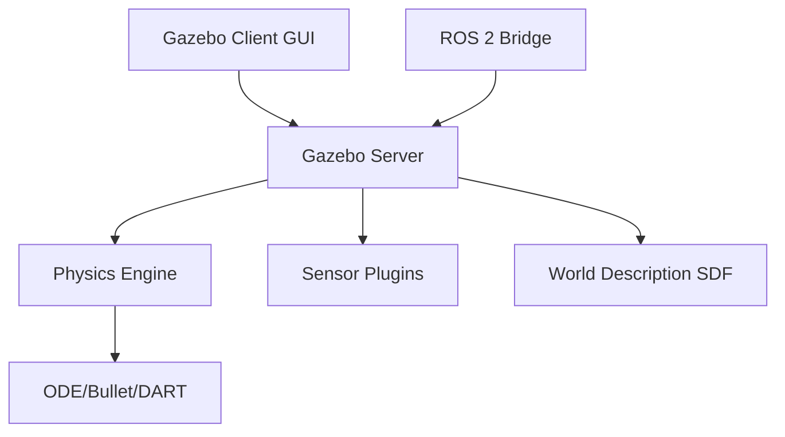

# Gazebo Simulation Fundamentals

## Introduction

Gazebo (specifically Gazebo Ignition/Gazebo Sim) is an open-source 3D robotics simulator that enables testing algorithms in realistic virtual environments before deploying to hardware. This chapter explores Gazebo's architecture, physics engines, and integration with ROS 2.

## Why Simulation?

Simulation accelerates development by providing:

- **Safety**: Test dangerous scenarios without hardware risk
- **Cost Efficiency**: Eliminate wear-and-tear on physical robots
- **Scalability**: Test multiple configurations in parallel
- **Reproducibility**: Exact scenario replication for debugging
- **Rapid Iteration**: Faster development cycles

## Gazebo Architecture



### Core Components

1. **Gazebo Server**: Headless simulation engine
2. **Gazebo Client**: 3D visualization GUI
3. **Physics Engines**: ODE (default), Bullet, DART, Simbody
4. **Plugin System**: Custom sensors, controllers, world modifications

## Simulation Description Format (SDF)

SDF defines worlds, models, and physics properties:

```xml
<?xml version="1.0"?>
<sdf version="1.8">
  <world name="warehouse">
    <!-- Physics configuration -->
    <physics name="default_physics" type="ode">
      <max_step_size>0.001</max_step_size>
      <real_time_factor>1</real_time_factor>
    </physics>

    <!-- Lighting -->
    <light type="directional" name="sun">
      <cast_shadows>true</cast_shadows>
      <pose>0 0 10 0 0 0</pose>
      <diffuse>0.8 0.8 0.8 1</diffuse>
    </light>

    <!-- Ground plane -->
    <model name="ground_plane">
      <static>true</static>
      <link name="link">
        <collision name="collision">
          <geometry>
            <plane><normal>0 0 1</normal></plane>
          </geometry>
        </collision>
        <visual name="visual">
          <geometry>
            <plane><normal>0 0 1</normal></plane>
          </geometry>
        </visual>
      </link>
    </model>

    <!-- Include robot model -->
    <include>
      <uri>model://mobile_robot</uri>
      <pose>0 0 0.1 0 0 0</pose>
    </include>
  </world>
</sdf>
```

## Physics Engines Comparison

| Engine | Accuracy | Performance | Use Case |
|--------|----------|-------------|----------|
| **ODE** | Medium | Fast | General robotics |
| **Bullet** | High | Medium | Manipulation, grasping |
| **DART** | High | Fast | Humanoids, contacts |
| **Simbody** | Very High | Slow | Biomechanics |

## Sensor Simulation

Gazebo provides high-fidelity sensor models:

### LiDAR Sensor

```xml
<sensor name="lidar" type="gpu_lidar">
  <topic>scan</topic>
  <update_rate>10</update_rate>
  <lidar>
    <scan>
      <horizontal>
        <samples>640</samples>
        <resolution>1</resolution>
        <min_angle>-1.57</min_angle>
        <max_angle>1.57</max_angle>
      </horizontal>
    </scan>
    <range>
      <min>0.08</min>
      <max>10.0</max>
      <resolution>0.01</resolution>
    </range>
  </lidar>
</sensor>
```

### Camera Sensor

```xml
<sensor name="camera" type="camera">
  <topic>camera/image</topic>
  <update_rate>30</update_rate>
  <camera>
    <horizontal_fov>1.047</horizontal_fov>
    <image>
      <width>640</width>
      <height>480</height>
      <format>R8G8B8</format>
    </image>
    <clip>
      <near>0.1</near>
      <far>100</far>
    </clip>
  </camera>
</sensor>
```

## ROS 2 Integration

### ros_gz_bridge

Bridge Gazebo topics to ROS 2:

```bash
# Install bridge
sudo apt install ros-humble-ros-gz

# Launch bridge
ros2 run ros_gz_bridge parameter_bridge \
  /world/warehouse/model/robot/link/lidar/scan@sensor_msgs/msg/LaserScan@gz.msgs.LaserScan
```

### Launch File Integration

```python
from launch import LaunchDescription
from launch.actions import IncludeLaunchDescription
from launch.launch_description_sources import PythonLaunchDescriptionSource
from launch_ros.actions import Node
import os

def generate_launch_description():
    # Start Gazebo
    gazebo = IncludeLaunchDescription(
        PythonLaunchDescriptionSource([
            os.path.join(get_package_share_directory('ros_gz_sim'),
                        'launch', 'gz_sim.launch.py')
        ]),
        launch_arguments={'gz_args': '-r warehouse.sdf'}.items()
    )

    # Bridge topics
    bridge = Node(
        package='ros_gz_bridge',
        executable='parameter_bridge',
        arguments=[
            '/scan@sensor_msgs/msg/LaserScan@gz.msgs.LaserScan',
            '/cmd_vel@geometry_msgs/msg/Twist@gz.msgs.Twist',
        ],
        output='screen'
    )

    return LaunchDescription([
        gazebo,
        bridge,
    ])
```

## Performance Optimization

### Real-Time Factor (RTF)

RTF measures simulation speed relative to wall-clock time:
- **RTF = 1.0**: Real-time simulation
- **RTF > 1.0**: Faster than real-time
- **RTF < 1.0**: Slower than real-time

```xml
<physics name="fast_physics" type="ode">
  <real_time_factor>2.0</real_time_factor>  <!-- 2x speed -->
  <max_step_size>0.002</max_step_size>
</physics>
```

### Optimization Techniques

1. **Simplify Collision Meshes**: Use primitive shapes (box, cylinder) instead of complex meshes
2. **Reduce Sensor Update Rates**: Lower Hz for non-critical sensors
3. **Disable Shadows**: Set `<cast_shadows>false</cast_shadows>`
4. **Use Headless Mode**: Run server-only without GUI
5. **GPU Acceleration**: Use `gpu_lidar` instead of `lidar`

```bash
# Headless simulation
gz sim -r -s warehouse.sdf
```

## Custom Gazebo Plugins

Extend functionality with C++ plugins:

```cpp
#include <gz/sim/System.hh>
#include <gz/plugin/Register.hh>

class CustomController : public gz::sim::System,
                          public gz::sim::ISystemPreUpdate
{
public:
  void PreUpdate(const gz::sim::UpdateInfo &_info,
                gz::sim::EntityComponentManager &_ecm) override
  {
    // Custom control logic
    auto cmdVel = computeVelocity();
    // Apply to robot
  }

private:
  gz::math::Vector3d computeVelocity() {
    // Control algorithm
    return gz::math::Vector3d(0.5, 0, 0);
  }
};

GZ_ADD_PLUGIN(
  CustomController,
  gz::sim::System,
  CustomController::ISystemPreUpdate)
```

## Debugging Simulations

```bash
# View model tree
gz model --list

# Inspect topics
gz topic --list
gz topic --echo /scan

# Check performance
gz stats

# Record simulation
gz log --record --file simulation.log

# Playback
gz log --playback simulation.log
```

## Common Pitfalls

1. **Incorrect Inertia Values**: Causes unstable physics
2. **Collision Mesh Complexity**: Degrades performance
3. **Time Step Too Large**: Introduces physics artifacts
4. **Missing Damping**: Results in perpetual motion
5. **Improper Contact Parameters**: Unrealistic interactions

## Summary

Gazebo provides a robust platform for robotics simulation with accurate physics, comprehensive sensor models, and seamless ROS 2 integration. Mastering SDF configuration, physics tuning, and plugin development enables rapid prototyping and validation of robotic systems.

## References

1. [Gazebo Sim Documentation](https://gazebosim.org/docs)
2. [SDF Format Specification](http://sdformat.org/)
3. [ros_gz Bridge](https://github.com/gazebosim/ros_gz)
4. [Physics Engine Comparison (Erez et al., 2015)](https://homes.cs.washington.edu/~todorov/papers/ErezICRA15.pdf)
5. [Gazebo Best Practices](https://classic.gazebosim.org/tutorials?cat=guided_b&tut=guided_b1)

---

**Previous**: Module 1 | **Next**: [2.2 Robot Description (URDF)](./chapter-2-2.md)
