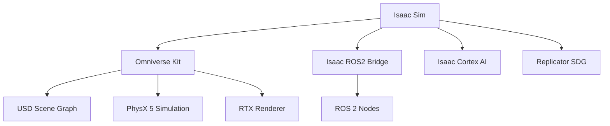

# NVIDIA Isaac Sim Introduction

## Introduction

NVIDIA Isaac Sim is a GPU-accelerated robotics simulator built on NVIDIA Omniverse, providing photorealistic rendering, accurate physics simulation, and AI/ML integration. This chapter introduces Isaac Sim's architecture, USD workflows, and advantages over traditional simulators.

## What is Isaac Sim?

Isaac Sim combines:
- **PhysX 5**: GPU-accelerated rigid body, soft body, and fluid dynamics
- **RTX Ray Tracing**: Photorealistic rendering for synthetic data generation
- **Universal Scene Description (USD)**: Industry-standard 3D scene format
- **ROS 2 Integration**: Native bridge for robot control and sensor data

### Key Advantages

| Feature | Traditional Simulators | Isaac Sim |
|---------|----------------------|-----------|
| **Physics** | CPU-based (ODE/Bullet) | GPU PhysX 5 (10-100x faster) |
| **Rendering** | Rasterization | RTX Ray Tracing |
| **Scale** | Single robot | Hundreds of robots in parallel |
| **Sensor Fidelity** | Approximate | Physically accurate (RTX sensors) |
| **AI/ML Integration** | External | Native (Isaac Gym, Replicator) |

## Architecture



## Universal Scene Description (USD)

USD is Pixar's open-source framework for describing 3D scenes:

```python
# Load USD stage
from pxr import Usd, UsdGeom

stage = Usd.Stage.Open("warehouse.usd")

# Create cube
cube_prim = stage.DefinePrim("/World/Cube", "Cube")
cube = UsdGeom.Cube(cube_prim)
cube.GetSizeAttr().Set(1.0)

# Set transform
xform = UsdGeom.Xformable(cube)
xform.AddTranslateOp().Set((0, 0, 1))

# Save
stage.Save()
```

### USD Composition

USD supports non-destructive layering:

```python
# Reference external asset
from pxr import Usd

stage = Usd.Stage.CreateNew("scene.usd")
robot_prim = stage.DefinePrim("/World/Robot")

# Add reference to robot USD
robot_prim.GetReferences().AddReference("./assets/robot.usd")

# Override properties (non-destructive)
UsdGeom.Xformable(robot_prim).AddTranslateOp().Set((1, 2, 0))
```

## Isaac Sim Python API

### Creating a Simple Scene

```python
from omni.isaac.kit import SimulationApp

# Launch Isaac Sim
simulation_app = SimulationApp({"headless": False})

from omni.isaac.core import World
from omni.isaac.core.objects import DynamicCuboid
from omni.isaac.core.prims import RigidPrimView
import numpy as np

# Create world
world = World()
world.scene.add_default_ground_plane()

# Add dynamic cube
cube = world.scene.add(
    DynamicCuboid(
        prim_path="/World/Cube",
        name="cube",
        position=np.array([0, 0, 1.0]),
        scale=np.array([0.2, 0.2, 0.2]),
        color=np.array([0.8, 0.1, 0.1])
    )
)

# Reset simulation
world.reset()

# Run simulation loop
for i in range(1000):
    world.step(render=True)

# Cleanup
simulation_app.close()
```

### Robot Import

```python
from omni.isaac.core.robots import Robot
from omni.isaac.core.utils.stage import add_reference_to_stage

# Import robot from USD
robot_prim_path = "/World/Franka"
robot_usd_path = "http://omniverse-content-production.s3-us-west-2.amazonaws.com/Assets/Isaac/2023.1.0/Isaac/Robots/Franka/franka_alt_fingers.usd"

add_reference_to_stage(usd_path=robot_usd_path, prim_path=robot_prim_path)

# Create robot instance
robot = Robot(prim_path=robot_prim_path)
world.scene.add(robot)

# Control robot joints
robot.set_joint_positions(np.array([0, -0.5, 0, -1.5, 0, 1.0, 0.8]))
```

## ROS 2 Integration

### Omnigraph ROS2 Bridge

Isaac Sim uses Omnigraph (visual node editor) for ROS 2 integration:

```python
import omni.graph.core as og

# Create action graph
keys = og.Controller.Keys
(graph, nodes, _, _) = og.Controller.edit(
    {
        "graph_path": "/World/ActionGraph",
        "evaluator_name": "execution",
    },
    {
        keys.CREATE_NODES: [
            ("OnPlaybackTick", "omni.graph.action.OnPlaybackTick"),
            ("PublishClock", "omni.isaac.ros2_bridge.ROS2PublishClock"),
            ("PublishTF", "omni.isaac.ros2_bridge.ROS2PublishTransformTree"),
        ],
        keys.CONNECT: [
            ("OnPlaybackTick.outputs:tick", "PublishClock.inputs:execIn"),
            ("OnPlaybackTick.outputs:tick", "PublishTF.inputs:execIn"),
        ],
    },
)
```

### Camera Publisher

```python
# Add camera
from omni.isaac.core.utils.prims import create_prim

camera_path = "/World/Camera"
create_prim(
    prim_path=camera_path,
    prim_type="Camera",
    position=np.array([2.0, 2.0, 1.5]),
    orientation=np.array([1, 0, 0, 0])
)

# Publish to ROS 2
(graph, nodes, _, _) = og.Controller.edit(
    {
        "graph_path": "/World/CameraGraph",
        "evaluator_name": "execution",
    },
    {
        keys.CREATE_NODES: [
            ("OnTick", "omni.graph.action.OnPlaybackTick"),
            ("CameraHelper", "omni.isaac.core_nodes.IsaacReadCameraInfo"),
            ("ROS2CameraPub", "omni.isaac.ros2_bridge.ROS2CameraHelper"),
        ],
        keys.SET_VALUES: [
            ("CameraHelper.inputs:cameraPrim", [camera_path]),
            ("ROS2CameraPub.inputs:topicName", "rgb"),
            ("ROS2CameraPub.inputs:frameId", "camera"),
        ],
        keys.CONNECT: [
            ("OnTick.outputs:tick", "CameraHelper.inputs:execIn"),
            ("CameraHelper.outputs:execOut", "ROS2CameraPub.inputs:execIn"),
            ("CameraHelper.outputs:cameraInfo", "ROS2CameraPub.inputs:cameraInfoData"),
        ],
    },
)
```

## Synthetic Data Generation

### Replicator for Domain Randomization

```python
import omni.replicator.core as rep

# Define randomization
def sphere_lights(num=5):
    lights = rep.create.light(
        light_type="Sphere",
        temperature=rep.distribution.normal(6500, 500),
        intensity=rep.distribution.normal(35000, 5000),
        position=rep.distribution.uniform((-5, -5, 2), (5, 5, 5)),
        count=num
    )
    return lights.node

# Register randomizer
rep.randomizer.register(sphere_lights)

# Setup camera and attach writer
camera = rep.create.camera(position=(5, 5, 5), look_at=(0, 0, 0))
render_product = rep.create.render_product(camera, (512, 512))

# Write annotations
writer = rep.WriterRegistry.get("BasicWriter")
writer.initialize(
    output_dir="_output",
    rgb=True,
    bounding_box_2d_tight=True,
    semantic_segmentation=True
)
writer.attach([render_product])

# Run randomization
with rep.trigger.on_frame(num_frames=100):
    rep.randomizer.sphere_lights(5)
```

## Performance Optimization

### GPU Simulation Settings

```python
# Enable GPU dynamics
from pxr import PhysxSchema

scene = PhysxSchema.PhysxSceneAPI.Apply(stage.GetPrimAtPath("/World/physicsScene"))
scene.GetEnableGPUDynamicsAttr().Set(True)
scene.GetBroadphaseTypeAttr().Set("GPU")
scene.GetSolverTypeAttr().Set("TGS")

# Configure GPU buffers
scene.GetGpuMaxRigidContactCountAttr().Set(524288)
scene.GetGpuMaxRigidPatchCountAttr().Set(81920)
```

### Parallel Environments

```python
# Create multiple robot instances
num_envs = 100
env_spacing = 5.0

for i in range(num_envs):
    x = (i % 10) * env_spacing
    y = (i // 10) * env_spacing

    # Clone robot
    robot_path = f"/World/Robot_{i}"
    add_reference_to_stage(
        usd_path=robot_usd_path,
        prim_path=robot_path
    )

    # Set position
    UsdGeom.Xformable(stage.GetPrimAtPath(robot_path)).AddTranslateOp().Set((x, y, 0))
```

## Summary

NVIDIA Isaac Sim represents the next generation of robotics simulation, leveraging GPU acceleration, photorealistic rendering, and AI/ML integration. USD provides a powerful framework for scene composition, while native ROS 2 integration enables seamless robot development workflows.

## References

1. [Isaac Sim Documentation](https://docs.omniverse.nvidia.com/isaacsim/latest/index.html)
2. [USD Documentation](https://graphics.pixar.com/usd/docs/index.html)
3. [Omniverse Replicator](https://docs.omniverse.nvidia.com/prod_extensions/prod_extensions/ext_replicator.html)
4. [Isaac ROS 2 Bridge](https://docs.omniverse.nvidia.com/isaacsim/latest/ros2_tutorials/index.html)
5. [PhysX 5 Documentation](https://nvidia-omniverse.github.io/PhysX/physx/5.1.0/)

---

**Previous**: Module 2 | **Next**: [3.2 AI-Powered Perception](./chapter-3-2.md)
