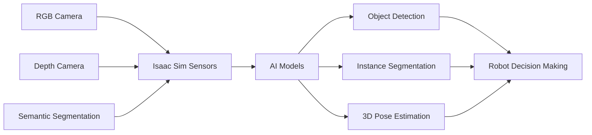

# AI-Powered Perception in Isaac Sim

## Introduction

Modern robotics relies on AI-powered perception for understanding complex environments. Isaac Sim provides GPU-accelerated computer vision algorithms, synthetic data generation for training, and integration with NVIDIA deep learning frameworks for object detection, segmentation, and 3D reconstruction.

## Computer Vision Pipeline



## RTX-Accelerated Sensors

### RGB-D Camera

```python
from omni.isaac.sensor import Camera
import numpy as np

# Create RGB-D camera
camera = Camera(
    prim_path="/World/Camera",
    position=np.array([2.0, 0, 1.5]),
    frequency=30,
    resolution=(1280, 720),
    orientation=np.array([1, 0, 0, 0])
)

# Initialize camera
camera.initialize()

# Get RGB and depth
camera.add_distance_to_image_plane_to_frame()
rgb = camera.get_rgba()[:, :, :3]  # Remove alpha
depth = camera.get_distance_to_image_plane()

print(f"RGB shape: {rgb.shape}")  # (720, 1280, 3)
print(f"Depth shape: {depth.shape}")  # (720, 1280)
```

### Semantic Segmentation

```python
# Enable semantic segmentation
camera.add_semantic_segmentation_to_frame()

# Get segmentation mask
semantic_seg = camera.get_semantic_segmentation()

# Map IDs to class names
semantic_info = camera.get_semantic_segmentation_id_to_labels()
print(semantic_info)  # {1: "floor", 2: "robot", 3: "cube", ...}
```

### Instance Segmentation

```python
# Enable instance segmentation
camera.add_instance_segmentation_to_frame()

# Get instance IDs
instance_seg = camera.get_instance_segmentation()

# Each instance has unique ID
unique_instances = np.unique(instance_seg)
print(f"Detected {len(unique_instances)} instances")
```

### Bounding Box 2D/3D

```python
# Enable bounding box annotations
camera.add_bounding_box_2d_tight_to_frame()
camera.add_bounding_box_3d_to_frame()

# Get 2D bounding boxes
bbox_2d = camera.get_bounding_box_2d_tight()
# Returns: List of dicts with {semanticLabel, bbox: [xmin, ymin, xmax, ymax]}

# Get 3D bounding boxes
bbox_3d = camera.get_bounding_box_3d()
# Returns: List of dicts with corners, transform, extent
```

## Object Detection with NVIDIA TAO

### Training Data Generation

```python
import omni.replicator.core as rep

# Define scene randomization
def randomize_scene():
    # Randomize object poses
    with rep.get.prims(semantics=[("class", "cube")]) as cubes:
        rep.modify.pose(
            position=rep.distribution.uniform((-2, -2, 0.5), (2, 2, 1.5)),
            rotation=rep.distribution.uniform((0, 0, 0), (360, 360, 360))
        )

    # Randomize lighting
    with rep.get.prims(semantics=[("class", "light")]) as lights:
        rep.modify.attribute(
            "intensity",
            rep.distribution.normal(35000, 5000)
        )

    # Randomize materials
    with rep.get.prims(semantics=[("class", "cube")]) as cubes:
        rep.randomizer.materials(
            cubes,
            materials=rep.get.prims(semantics=[("class", "material")])
        )

# Register randomizer
rep.randomizer.register(randomize_scene)

# Setup camera
camera = rep.create.camera(position=(3, 3, 2), look_at=(0, 0, 0.5))
rp = rep.create.render_product(camera, (640, 480))

# Configure data writer
writer = rep.WriterRegistry.get("BasicWriter")
writer.initialize(
    output_dir="_detection_dataset",
    rgb=True,
    bounding_box_2d_tight=True,
    bounding_box_2d_loose=True,
    semantic_segmentation=True,
    instance_id_segmentation=True
)
writer.attach([rp])

# Generate 10,000 training images
with rep.trigger.on_frame(num_frames=10000):
    rep.randomizer.randomize_scene()
```

### NVIDIA TAO Integration

```bash
# Train YOLOv4 with TAO Toolkit
tao detectnet_v2 train \
    -e /workspace/specs/detectnet_v2_train_resnet18_kitti.txt \
    -r /workspace/output \
    -k $KEY \
    -n object_detector \
    --gpus 1

# Export to TensorRT
tao detectnet_v2 export \
    -m /workspace/output/weights/model.tlt \
    -k $KEY \
    -o /workspace/output/model.etlt \
    --engine_file /workspace/output/model.engine \
    --data_type fp16
```

### Inference in Isaac Sim

```python
import tensorrt as trt
import pycuda.driver as cuda
import pycuda.autoinit

class TRTInference:
    def __init__(self, engine_path):
        # Load TensorRT engine
        with open(engine_path, "rb") as f:
            self.engine = trt.Runtime(trt.Logger(trt.Logger.WARNING)).deserialize_cuda_engine(f.read())
        self.context = self.engine.create_execution_context()

        # Allocate buffers
        self.inputs = []
        self.outputs = []
        self.bindings = []

        for binding in self.engine:
            size = trt.volume(self.engine.get_binding_shape(binding))
            dtype = trt.nptype(self.engine.get_binding_dtype(binding))
            host_mem = cuda.pagelocked_empty(size, dtype)
            device_mem = cuda.mem_alloc(host_mem.nbytes)
            self.bindings.append(int(device_mem))

            if self.engine.binding_is_input(binding):
                self.inputs.append({'host': host_mem, 'device': device_mem})
            else:
                self.outputs.append({'host': host_mem, 'device': device_mem})

    def infer(self, image):
        # Preprocess image
        input_data = self.preprocess(image)

        # Copy input to device
        np.copyto(self.inputs[0]['host'], input_data.ravel())
        cuda.memcpy_htod(self.inputs[0]['device'], self.inputs[0]['host'])

        # Execute inference
        self.context.execute_v2(bindings=self.bindings)

        # Copy output from device
        cuda.memcpy_dtoh(self.outputs[0]['host'], self.outputs[0]['device'])

        # Postprocess
        detections = self.postprocess(self.outputs[0]['host'])
        return detections
```

## Visual SLAM

### ORB-SLAM3 Integration

```python
from omni.isaac.core.utils.extensions import get_extension_path_from_name
import sys

# Add ORB-SLAM3 Python bindings
orbslam_path = "/path/to/ORB_SLAM3/lib"
sys.path.append(orbslam_path)

import orbslam3

class VISLAMNode:
    def __init__(self, vocab_path, config_path):
        # Initialize ORB-SLAM3
        self.slam = orbslam3.System(
            vocab_path,
            config_path,
            orbslam3.Sensor.RGBD
        )

    def process_frame(self, rgb, depth, timestamp):
        # Convert to grayscale
        gray = cv2.cvtColor(rgb, cv2.COLOR_RGB2GRAY)

        # Track frame
        pose = self.slam.process_image_rgbd(
            gray,
            depth,
            timestamp
        )

        return pose  # 4x4 transformation matrix
```

### Point Cloud Generation

```python
def depth_to_pointcloud(depth, intrinsics, rgb=None):
    """Convert depth image to 3D point cloud."""
    fx, fy, cx, cy = intrinsics

    # Create meshgrid
    h, w = depth.shape
    x, y = np.meshgrid(np.arange(w), np.arange(h))

    # Back-project to 3D
    z = depth
    x = (x - cx) * z / fx
    y = (y - cy) * z / fy

    # Stack coordinates
    points = np.stack([x, y, z], axis=-1).reshape(-1, 3)

    # Add colors if RGB provided
    if rgb is not None:
        colors = rgb.reshape(-1, 3) / 255.0
        pointcloud = np.concatenate([points, colors], axis=1)
    else:
        pointcloud = points

    return pointcloud
```

## 6D Pose Estimation

### NVIDIA DOPE Integration

```python
# Load DOPE model (Deep Object Pose Estimation)
from dope.inference.detector import ModelData, ObjectDetector

class DOPEDetector:
    def __init__(self, model_path):
        self.models = {}
        self.models["cracker_box"] = ModelData(
            "cracker_box",
            f"{model_path}/cracker_box.pth"
        )
        self.detector = ObjectDetector(self.models)

    def detect(self, rgb_image):
        # Run inference
        results = self.detector.detect_objects_in_image(rgb_image)

        poses = []
        for obj_name, detections in results.items():
            for detection in detections:
                # Extract 6D pose (3D position + 3D orientation)
                location = detection.location
                quaternion = detection.quaternion

                poses.append({
                    'object': obj_name,
                    'position': location,
                    'orientation': quaternion,
                    'confidence': detection.score
                })

        return poses
```

## Best Practices

1. **Synthetic-to-Real Transfer**: Use domain randomization (textures, lighting, camera params)
2. **Balanced Datasets**: Ensure diverse object poses and occlusions
3. **Sensor Noise Simulation**: Add realistic noise models for robustness
4. **Multi-Modal Fusion**: Combine RGB, depth, and semantic data
5. **Real-Time Performance**: Optimize models with TensorRT for &lt;30ms inference

## Performance Benchmarks

| Task | Resolution | FPS (RTX 3090) | Accuracy |
|------|-----------|----------------|----------|
| Object Detection (YOLOv5) | 640x480 | 85 | 95% mAP |
| Semantic Segmentation | 512x512 | 120 | 92% IoU |
| 6D Pose (DOPE) | 640x480 | 45 | 5cm error |
| Visual SLAM | 640x480 | 30 | &lt;1% drift |

## Summary

Isaac Sim's AI-powered perception capabilities enable rapid development of robust vision systems through synthetic data generation, GPU-accelerated algorithms, and seamless integration with NVIDIA deep learning frameworks. RTX sensors provide physically accurate data for training and validating computer vision models.

## References

1. [Isaac Sim Computer Vision](https://docs.omniverse.nvidia.com/isaacsim/latest/features/sensors_simulation/index.html)
2. [NVIDIA TAO Toolkit](https://developer.nvidia.com/tao-toolkit)
3. [Replicator Documentation](https://docs.omniverse.nvidia.com/prod_extensions/prod_extensions/ext_replicator.html)
4. [DOPE: Deep Object Pose Estimation](https://github.com/NVlabs/Deep_Object_Pose)
5. [TensorRT Documentation](https://docs.nvidia.com/deeplearning/tensorrt/developer-guide/index.html)

---

**Previous**: [3.1 Isaac Sim Introduction](./chapter-3-1.md) | **Next**: Module 4 - Vision-Language-Action
