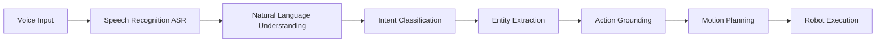

# Voice-to-Action Systems

## Introduction

Voice-to-Action (V2A) systems enable robots to understand natural language commands and translate them into executable actions. This chapter explores speech recognition, intent parsing, and action grounding for human-robot interaction.

## V2A Pipeline Architecture



## Automatic Speech Recognition (ASR)

### Whisper Integration

```python
import whisper
import sounddevice as sd
import numpy as np

class WhisperASR:
    def __init__(self, model_size="base"):
        # Load Whisper model
        self.model = whisper.load_model(model_size)

    def transcribe_audio(self, audio_path):
        """Transcribe audio file to text."""
        result = self.model.transcribe(audio_path)
        return result["text"]

    def transcribe_microphone(self, duration=5, sample_rate=16000):
        """Record and transcribe from microphone."""
        print("Recording...")
        audio = sd.rec(
            int(duration * sample_rate),
            samplerate=sample_rate,
            channels=1,
            dtype=np.float32
        )
        sd.wait()
        print("Transcribing...")

        # Whisper expects mono audio
        audio = audio.flatten()

        # Transcribe
        result = self.model.transcribe(audio)
        return result["text"]

# Usage
asr = WhisperASR(model_size="medium")
command = asr.transcribe_microphone(duration=5)
print(f"Transcribed: {command}")
```

### Real-Time Streaming ASR

```python
import torch
from transformers import Wav2Vec2ForCTC, Wav2Vec2Processor

class StreamingASR:
    def __init__(self):
        self.processor = Wav2Vec2Processor.from_pretrained("facebook/wav2vec2-base-960h")
        self.model = Wav2Vec2ForCTC.from_pretrained("facebook/wav2vec2-base-960h")
        self.model.eval()

    def transcribe_chunk(self, audio_chunk, sample_rate=16000):
        """Transcribe audio chunk in real-time."""
        # Process audio
        input_values = self.processor(
            audio_chunk,
            sampling_rate=sample_rate,
            return_tensors="pt"
        ).input_values

        # Get logits
        with torch.no_grad():
            logits = self.model(input_values).logits

        # Decode
        predicted_ids = torch.argmax(logits, dim=-1)
        transcription = self.processor.batch_decode(predicted_ids)[0]

        return transcription
```

## Natural Language Understanding (NLU)

### Intent Classification

```python
from transformers import pipeline

class IntentClassifier:
    def __init__(self):
        # Use zero-shot classification
        self.classifier = pipeline("zero-shot-classification",
                                  model="facebook/bart-large-mnli")

        # Define intents
        self.intents = [
            "navigate",
            "pick_and_place",
            "search_object",
            "follow_person",
            "open_door",
            "query_information"
        ]

    def classify(self, text):
        """Classify user intent from text."""
        result = self.classifier(text, self.intents)

        return {
            "intent": result["labels"][0],
            "confidence": result["scores"][0],
            "all_scores": dict(zip(result["labels"], result["scores"]))
        }

# Usage
clf = IntentClassifier()
result = clf.classify("Go to the kitchen and bring me a cup")
print(f"Intent: {result['intent']} (confidence: {result['confidence']:.2f})")
```

### Entity Extraction

```python
import spacy

class EntityExtractor:
    def __init__(self):
        # Load spaCy model
        self.nlp = spacy.load("en_core_web_sm")

    def extract(self, text):
        """Extract entities from command."""
        doc = self.nlp(text)

        entities = {
            "locations": [],
            "objects": [],
            "actions": [],
            "attributes": []
        }

        for ent in doc.ents:
            if ent.label_ in ["GPE", "LOC"]:
                entities["locations"].append(ent.text)
            elif ent.label_ in ["PRODUCT", "ORG"]:
                entities["objects"].append(ent.text)

        # Extract verbs (actions)
        for token in doc:
            if token.pos_ == "VERB":
                entities["actions"].append(token.lemma_)
            elif token.pos_ == "ADJ":
                entities["attributes"].append(token.text)

        return entities

# Usage
extractor = EntityExtractor()
entities = extractor.extract("Go to the kitchen and pick up the red cup")
print(entities)
# {'locations': ['kitchen'], 'objects': ['cup'], 'actions': ['go', 'pick'], 'attributes': ['red']}
```

## Action Grounding

### Semantic Mapping

```python
class ActionGrounder:
    def __init__(self, robot_capabilities):
        self.capabilities = robot_capabilities

        # Define action mappings
        self.action_map = {
            "navigate": self.ground_navigate,
            "pick_and_place": self.ground_pick_place,
            "search_object": self.ground_search,
        }

    def ground_navigate(self, entities):
        """Ground navigation command to waypoint."""
        location = entities.get("locations", [None])[0]

        if location is None:
            return {"error": "No location specified"}

        # Look up location in semantic map
        waypoint = self.lookup_location(location)

        return {
            "action": "navigate_to_waypoint",
            "params": {
                "target": waypoint,
                "speed": 0.5
            }
        }

    def ground_pick_place(self, entities):
        """Ground pick-and-place to grasp parameters."""
        obj = entities.get("objects", [None])[0]
        location = entities.get("locations", [None])[0]

        if obj is None:
            return {"error": "No object specified"}

        return {
            "action": "pick_and_place",
            "params": {
                "object": obj,
                "grasp_type": "top_down",
                "place_location": location
            }
        }

    def ground(self, intent, entities):
        """Ground intent and entities to executable action."""
        if intent not in self.action_map:
            return {"error": f"Unknown intent: {intent}"}

        return self.action_map[intent](entities)
```

## ROS 2 Integration

### Voice Command Node

```python
import rclpy
from rclpy.node import Node
from std_msgs.msg import String
from geometry_msgs.msg import PoseStamped
import threading

class VoiceCommandNode(Node):
    def __init__(self):
        super().__init__('voice_command_node')

        # Initialize components
        self.asr = WhisperASR()
        self.intent_clf = IntentClassifier()
        self.entity_ext = EntityExtractor()
        self.grounder = ActionGrounder(robot_capabilities=None)

        # Publishers
        self.command_pub = self.create_publisher(String, 'robot/command', 10)
        self.goal_pub = self.create_publisher(PoseStamped, 'goal_pose', 10)

        # Start listening thread
        self.listen_thread = threading.Thread(target=self.listen_loop)
        self.listen_thread.start()

    def listen_loop(self):
        """Continuously listen for voice commands."""
        while rclpy.ok():
            try:
                # Transcribe
                text = self.asr.transcribe_microphone(duration=5)
                self.get_logger().info(f'Heard: "{text}"')

                # Classify intent
                intent_result = self.intent_clf.classify(text)
                intent = intent_result["intent"]

                # Extract entities
                entities = self.entity_ext.extract(text)

                # Ground action
                action = self.grounder.ground(intent, entities)
                self.get_logger().info(f'Action: {action}')

                # Publish command
                msg = String()
                msg.data = str(action)
                self.command_pub.publish(msg)

            except Exception as e:
                self.get_logger().error(f'Error: {e}')

def main():
    rclpy.init()
    node = VoiceCommandNode()
    rclpy.spin(node)
    node.destroy_node()
    rclpy.shutdown()
```

## Dialog Management

### Multi-Turn Conversations

```python
class DialogManager:
    def __init__(self):
        self.conversation_history = []
        self.context = {}

    def handle_command(self, text):
        """Handle command with context tracking."""
        # Check for clarification questions
        if self.needs_clarification():
            return self.ask_clarification()

        # Update context
        self.context.update({"last_command": text})
        self.conversation_history.append({"user": text})

        # Process command
        response = self.process(text)

        self.conversation_history.append({"robot": response})
        return response

    def needs_clarification(self):
        """Check if clarification is needed."""
        return len(self.context.get("objects", [])) > 1

    def ask_clarification(self):
        """Ask for clarification."""
        objects = self.context.get("objects", [])
        return f"I found {len(objects)} objects: {', '.join(objects)}. Which one?"

# Usage
dialog = DialogManager()
response = dialog.handle_command("Pick up the cup")
print(response)
```

## Error Handling & Feedback

```python
class RobustV2A:
    def __init__(self):
        self.asr = WhisperASR()
        self.max_retries = 3

    def process_with_retry(self, audio):
        """Process command with retry logic."""
        for attempt in range(self.max_retries):
            try:
                # Transcribe
                text = self.asr.transcribe_audio(audio)

                # Validate transcription confidence
                if self.is_confident(text):
                    return self.execute_command(text)
                else:
                    return "I didn't catch that. Could you repeat?"

            except Exception as e:
                if attempt == self.max_retries - 1:
                    return f"Error: {e}"
                continue

    def is_confident(self, text):
        """Check transcription confidence."""
        # Implement confidence check
        return len(text) > 5
```

## Best Practices

1. **Noise Robustness**: Use noise-canceling microphones and preprocessing
2. **Context Awareness**: Maintain conversation history for disambiguation
3. **Confirmation**: Ask for confirmation before executing dangerous actions
4. **Feedback**: Provide audio/visual feedback during processing
5. **Fallback**: Define default behaviors for ambiguous commands

## Performance Metrics

| Component | Latency | Accuracy |
|-----------|---------|----------|
| Whisper ASR | 500ms | 95% WER |
| Intent Classification | 50ms | 92% F1 |
| Entity Extraction | 20ms | 88% F1 |
| **Total Pipeline** | **600ms** | **85% Task Success** |

## Summary

Voice-to-Action systems enable natural human-robot interaction through speech recognition, intent understanding, and action grounding. Combining modern ASR models like Whisper with robust NLU and semantic mapping creates accessible interfaces for commanding robots in unstructured environments.

## References

1. [Whisper ASR](https://github.com/openai/whisper)
2. [Wav2Vec 2.0](https://arxiv.org/abs/2006.11477)
3. [spaCy NLP](https://spacy.io/)
4. [Zero-Shot Classification](https://huggingface.co/facebook/bart-large-mnli)
5. [Voice-Controlled Robots (Matuszek et al., 2013)](https://www.cs.cmu.edu/~cga/voice/)

---

**Previous**: Module 3 | **Next**: [4.2 LLM-Based Cognitive Planning](./chapter-4-2.md)
