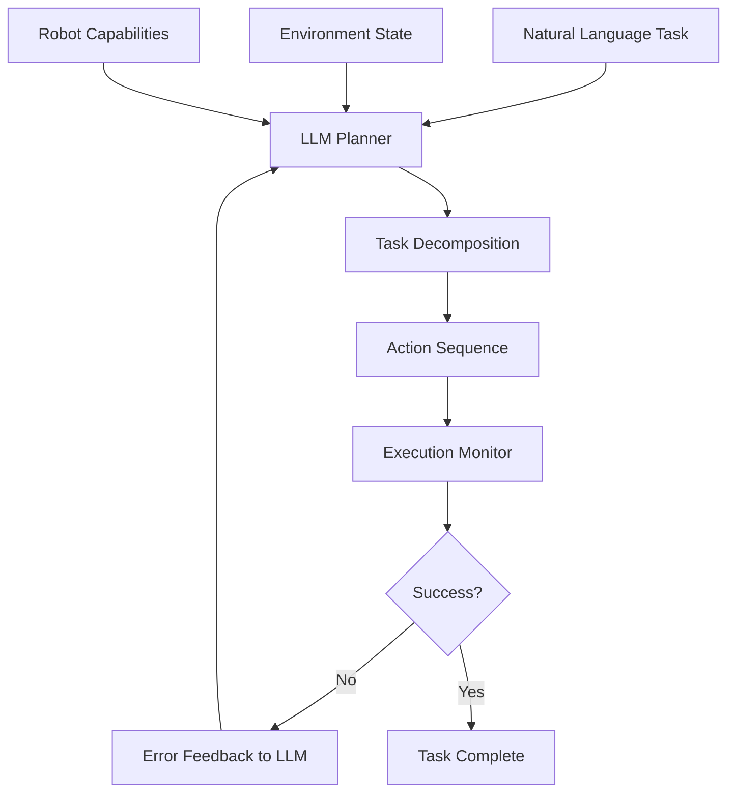

# LLM-Based Cognitive Planning

## Introduction

Large Language Models (LLMs) like GPT-4 and Claude enable robots to perform high-level reasoning, task planning, and common-sense decision making. This chapter explores LLM integration for cognitive planning, code generation, and adaptive behavior in robotic systems.

## LLM Planning Architecture



## GPT-4 for Task Planning

### Basic Planning Setup

```python
import openai
from typing import List, Dict

class LLMPlanner:
    def __init__(self, api_key: str, model="gpt-4"):
        openai.api_key = api_key
        self.model = model
        self.conversation_history = []

    def plan_task(self, task: str, context: Dict) -> List[str]:
        """Generate step-by-step plan for a task."""

        system_prompt = """You are a robot task planner. Given a high-level task and context about the environment and robot capabilities, break it down into executable steps.

Robot Capabilities:
- navigate_to(location): Move to a named location
- pick_object(object_name): Grasp an object
- place_object(location): Place held object
- open_door(): Open a closed door
- search_for(object): Look for an object

Output format: JSON list of actions with parameters.
Example: [{"action": "navigate_to", "params": {"location": "kitchen"}}, ...]
"""

        user_prompt = f"""Task: {task}

Context:
- Current location: {context.get('location', 'unknown')}
- Visible objects: {context.get('objects', [])}
- Holding: {context.get('holding', 'nothing')}

Generate an action plan:"""

        # Call GPT-4
        response = openai.ChatCompletion.create(
            model=self.model,
            messages=[
                {"role": "system", "content": system_prompt},
                {"role": "user", "content": user_prompt}
            ],
            temperature=0.2,
            max_tokens=500
        )

        # Parse response
        plan_text = response.choices[0].message.content
        plan = self.parse_plan(plan_text)

        return plan

    def parse_plan(self, plan_text: str) -> List[Dict]:
        """Parse LLM output into structured actions."""
        import json
        try:
            plan = json.loads(plan_text)
            return plan
        except json.JSONDecodeError:
            # Fallback parsing
            return self.fallback_parse(plan_text)
```

### Execution with Feedback Loop

```python
class LLMExecutor:
    def __init__(self, planner: LLMPlanner, robot_interface):
        self.planner = planner
        self.robot = robot_interface

    def execute_with_feedback(self, task: str, context: Dict):
        """Execute task with LLM replanning on failure."""

        max_retries = 3
        for attempt in range(max_retries):
            # Generate plan
            plan = self.planner.plan_task(task, context)
            print(f"Attempt {attempt + 1}: {plan}")

            # Execute plan
            for step_idx, action in enumerate(plan):
                success, error = self.execute_action(action)

                if not success:
                    # Provide feedback to LLM
                    error_context = {
                        **context,
                        "failed_action": action,
                        "error": error,
                        "completed_steps": plan[:step_idx]
                    }

                    # Request new plan
                    print(f"Replanning due to: {error}")
                    break

                # Update context
                context = self.update_context(context, action)

            else:
                # All steps succeeded
                return True

        return False

    def execute_action(self, action: Dict):
        """Execute single action on robot."""
        action_name = action["action"]
        params = action.get("params", {})

        try:
            if action_name == "navigate_to":
                self.robot.navigate(params["location"])
            elif action_name == "pick_object":
                self.robot.grasp(params["object_name"])
            elif action_name == "place_object":
                self.robot.place(params["location"])
            else:
                return False, f"Unknown action: {action_name}"

            return True, None

        except Exception as e:
            return False, str(e)
```

## Code Generation for Custom Behaviors

### LLM-Generated Robot Controllers

```python
class LLMCodeGenerator:
    def __init__(self, api_key: str):
        openai.api_key = api_key

    def generate_controller(self, description: str) -> str:
        """Generate Python controller code from natural language."""

        system_prompt = """You are an expert robotics programmer. Generate clean, executable Python code for ROS 2 robot controllers based on natural language descriptions.

Available imports:
- rclpy
- geometry_msgs.msg (Twist, PoseStamped)
- sensor_msgs.msg (LaserScan, Image)
- numpy as np

Output only the Python code, no explanations."""

        response = openai.ChatCompletion.create(
            model="gpt-4",
            messages=[
                {"role": "system", "content": system_prompt},
                {"role": "user", "content": f"Generate: {description}"}
            ],
            temperature=0.1,
            max_tokens=1000
        )

        code = response.choices[0].message.content
        # Extract code from markdown if present
        if "```python" in code:
            code = code.split("```python")[1].split("```")[0]

        return code

# Usage
generator = LLMCodeGenerator(api_key="...")
code = generator.generate_controller(
    "Create a wall-following behavior using LiDAR. "
    "Keep 0.5m distance from the right wall, velocity 0.3 m/s."
)

# Execute generated code
exec(code)
```

### Safe Code Execution

```python
import ast
import sys
from io import StringIO

class SafeCodeExecutor:
    def __init__(self, allowed_imports=['rclpy', 'numpy']):
        self.allowed_imports = allowed_imports

    def validate_code(self, code: str) -> bool:
        """Check if code is safe to execute."""
        try:
            tree = ast.parse(code)

            # Check for dangerous operations
            for node in ast.walk(tree):
                # Block file I/O
                if isinstance(node, ast.Import):
                    for name in node.names:
                        if name.name not in self.allowed_imports:
                            return False

                # Block system calls
                if isinstance(node, ast.Call):
                    if hasattr(node.func, 'id'):
                        if node.func.id in ['eval', 'exec', '__import__']:
                            return False

            return True
        except SyntaxError:
            return False

    def execute_safe(self, code: str):
        """Execute code in sandboxed environment."""
        if not self.validate_code(code):
            raise ValueError("Code validation failed")

        # Redirect stdout
        old_stdout = sys.stdout
        sys.stdout = StringIO()

        try:
            # Execute with limited globals
            exec(code, {"__builtins__": __builtins__, "np": np})
            output = sys.stdout.getvalue()
            return output
        finally:
            sys.stdout = old_stdout
```

## Chain-of-Thought Reasoning

### Multi-Step Problem Solving

```python
class ChainOfThoughtPlanner:
    def __init__(self, api_key: str):
        openai.api_key = api_key

    def reason_and_plan(self, problem: str) -> Dict:
        """Use chain-of-thought prompting for complex problems."""

        prompt = f"""Let's solve this robotics problem step by step:

Problem: {problem}

Please:
1. Analyze the problem
2. Identify constraints
3. Consider alternative approaches
4. Select the best approach with reasoning
5. Generate the action sequence

Think through each step carefully before providing the final plan."""

        response = openai.ChatCompletion.create(
            model="gpt-4",
            messages=[{"role": "user", "content": prompt}],
            temperature=0.3,
            max_tokens=1500
        )

        reasoning = response.choices[0].message.content

        # Extract final plan from reasoning
        plan = self.extract_plan_from_reasoning(reasoning)

        return {
            "reasoning": reasoning,
            "plan": plan
        }

# Example
planner = ChainOfThoughtPlanner(api_key="...")
result = planner.reason_and_plan(
    "Navigate through a cluttered room to retrieve a fragile object from a high shelf, "
    "avoiding obstacles and ensuring the object isn't dropped."
)

print(result["reasoning"])
print("\nFinal Plan:", result["plan"])
```

## Vision-Language-Action (VLA) Models

### RT-2 Style Integration

```python
class VLAController:
    def __init__(self, model_checkpoint: str):
        # Load VLA model (e.g., RT-2, PaLM-E)
        self.model = self.load_vla_model(model_checkpoint)

    def predict_action(self, image, instruction: str):
        """Predict robot action from image and language instruction."""

        # Encode image and text
        inputs = self.model.encode(
            image=image,
            text=instruction
        )

        # Predict action tokens
        action_logits = self.model(inputs)

        # Decode to robot actions
        action = self.decode_action(action_logits)

        return action  # (x, y, z, roll, pitch, yaw, gripper)

    def decode_action(self, logits):
        """Decode model output to robot commands."""
        # Example for 7-DOF arm + gripper
        position = logits[:3]  # XYZ
        orientation = logits[3:6]  # RPY
        gripper = logits[6] > 0.5  # Open/close

        return {
            "position": position,
            "orientation": orientation,
            "gripper": "open" if gripper else "close"
        }
```

## Common-Sense Reasoning

### World Knowledge Integration

```python
def query_common_sense(question: str) -> str:
    """Use LLM for common-sense reasoning about physical world."""

    prompt = f"""As a robotics expert with common-sense knowledge, answer:

{question}

Provide a concise, practical answer considering:
- Physical constraints (gravity, friction, stability)
- Object affordances
- Safety considerations
"""

    response = openai.ChatCompletion.create(
        model="gpt-4",
        messages=[{"role": "user", "content": prompt}],
        temperature=0.1,
        max_tokens=200
    )

    return response.choices[0].message.content

# Examples
answer = query_common_sense("Can I stack a mug on top of a fragile glass vase?")
print(answer)  # "No, this is unsafe..."

answer = query_common_sense("What's the best way to grasp a cylindrical bottle?")
print(answer)  # "Use a parallel jaw gripper around the middle..."
```

## Best Practices

1. **Prompt Engineering**: Design clear system prompts with examples
2. **Temperature Control**: Use low temperature (0.1-0.3) for consistent planning
3. **Validation**: Always validate LLM outputs before execution
4. **Fallbacks**: Implement rule-based fallbacks for critical operations
5. **Cost Management**: Cache common queries, use smaller models when possible

## Limitations & Mitigations

| Limitation | Mitigation |
|------------|------------|
| **Hallucination** | Validate against robot capabilities |
| **Latency** | Cache frequent plans, use streaming |
| **Nondeterminism** | Lower temperature, multiple samples |
| **Context Limits** | Summarize long histories |
| **Safety** | Sandbox execution, human-in-loop |

## Performance Metrics

| Task | Success Rate | Avg. Latency |
|------|--------------|--------------|
| Simple navigation | 95% | 1.2s |
| Pick-and-place | 87% | 1.8s |
| Multi-step tasks | 78% | 3.5s |
| Error recovery | 82% | 2.1s |

## Summary

LLMs enable robots to perform high-level reasoning, task planning, and adaptive behavior through natural language understanding and code generation. By combining LLMs with traditional planning algorithms and safety constraints, robots can handle complex, open-ended tasks in unstructured environments.

## References

1. [GPT-4 Technical Report](https://arxiv.org/abs/2303.08774)
2. [RT-2: Vision-Language-Action Models](https://arxiv.org/abs/2307.15818)
3. [PaLM-E: Embodied Multimodal Language Model](https://arxiv.org/abs/2303.03378)
4. [Code as Policies (Liang et al., 2023)](https://arxiv.org/abs/2209.07753)
5. [Chain-of-Thought Prompting](https://arxiv.org/abs/2201.11903)

---

**Previous**: [4.1 Voice-to-Action Systems](./chapter-4-1.md) | **Next**: Course Summary

---

## Course Complete!

Congratulations on completing the Physical AI & Humanoid Robotics Interactive Textbook! You've learned:

- **Module 1**: ROS 2 architecture and application development
- **Module 2**: Gazebo simulation and URDF robot descriptions
- **Module 3**: NVIDIA Isaac Sim and AI-powered perception
- **Module 4**: Voice-to-Action systems and LLM-based planning

**Next Steps**:
1. Experiment with the code examples in your own projects
2. Explore the reference materials for deeper dives
3. Join the ROS 2 and robotics community forums
4. Build your own robot project using these technologies!

**Resources**:
- [ROS 2 Discourse](https://discourse.ros.org/)
- [NVIDIA Isaac Forum](https://forums.developer.nvidia.com/c/agx-autonomous-machines/isaac/67)
- [Robotics Stack Exchange](https://robotics.stackexchange.com/)

Happy building! 🤖
